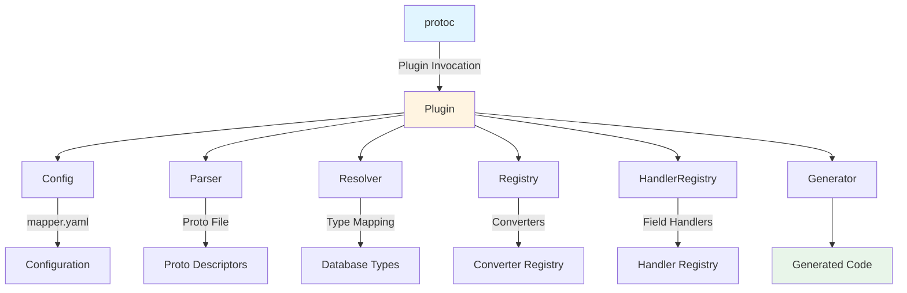
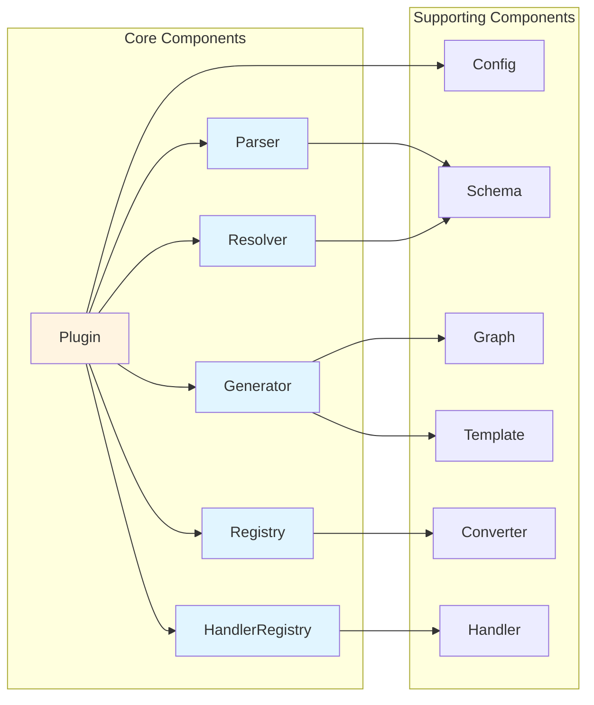
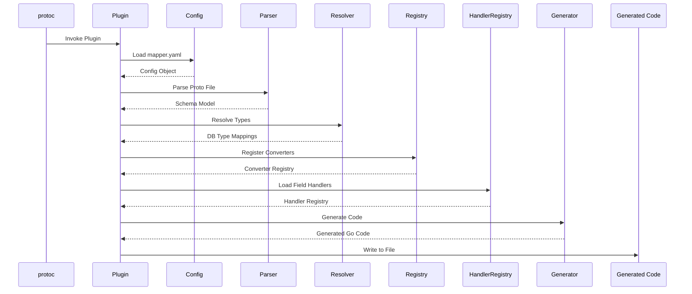
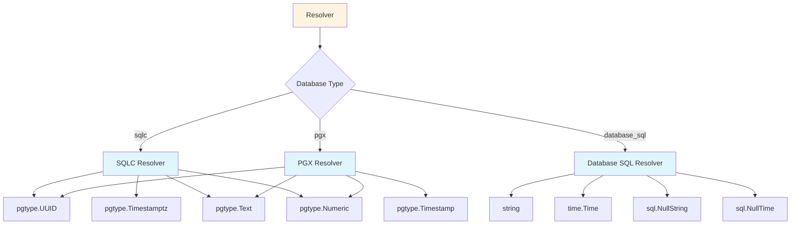
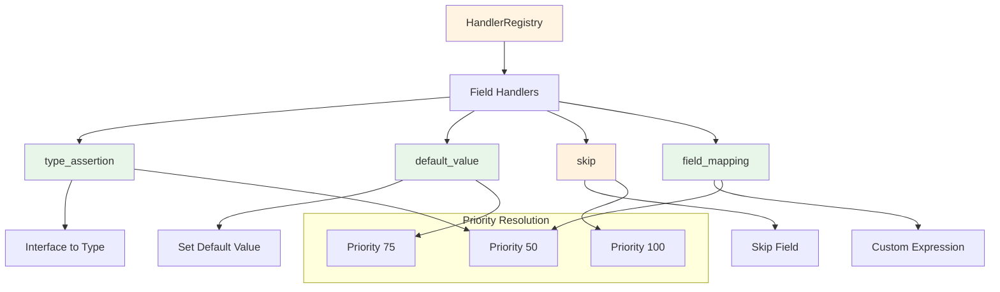
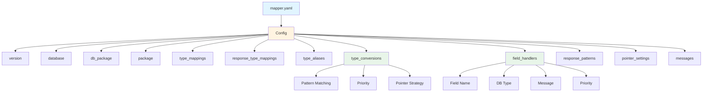
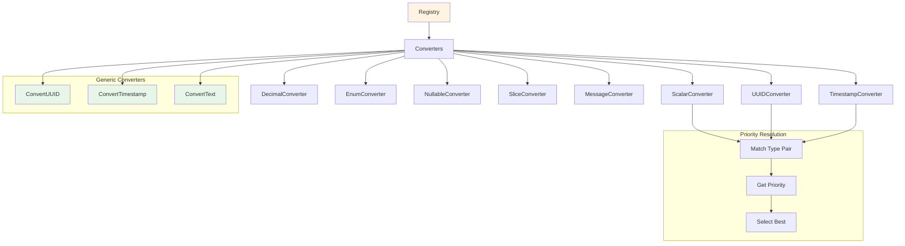
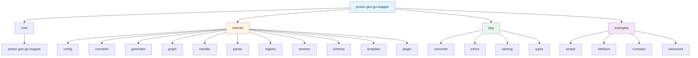
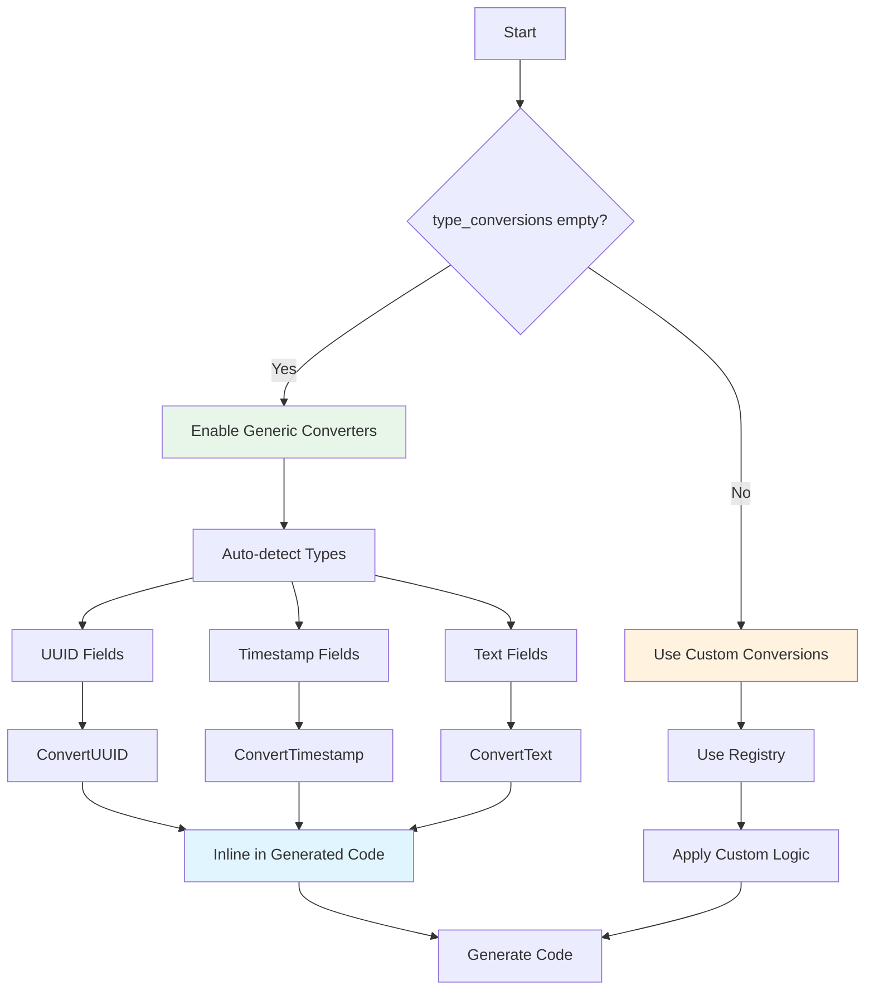
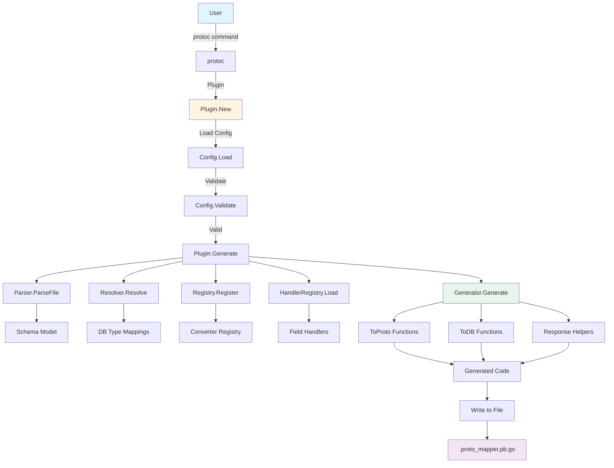

# protoc-gen-go-mapper Architecture Diagram

## High-Level Architecture

This diagram shows the overall flow from protoc invocation to generated code output. The Plugin orchestrates all components, coordinating configuration loading, proto parsing, type resolution, converter registration, field handler loading, and code generation.

**Components:**
- **protoc**: The Protocol Buffers compiler that invokes the plugin
- **Plugin**: Main orchestrator that coordinates all components
- **Config**: Loads and validates mapper.yaml configuration
- **Parser**: Parses proto files and extracts message definitions
- **Resolver**: Maps protobuf types to database-specific types
- **Registry**: Manages converter registration and resolution
- **HandlerRegistry**: Manages field handlers for special cases
- **Generator**: Produces Go mapping code
- **Generated Code**: Final output file with mapping functions

## Component Interaction Diagram

This diagram illustrates the relationships between core and supporting components. The Plugin acts as the central coordinator, connecting to all core components (Parser, Resolver, Registry, Generator, HandlerRegistry) and the Config component. Supporting components (Schema, Graph, Template, Converter, Handler) provide type definitions, mapping structures, code templates, conversion logic, and field handling capabilities.

**Core Components:**
- **Plugin**: Central orchestrator
- **Parser**: Extracts message structures from proto files
- **Resolver**: Maps types between protobuf and database
- **Registry**: Manages converter registration
- **Generator**: Produces final Go code
- **HandlerRegistry**: Manages field-level custom logic

**Supporting Components:**
- **Config**: Configuration management
- **Schema**: Type system definitions
- **Graph**: Mapping graph structures
- **Template**: Code generation templates
- **Converter**: Type conversion implementations
- **Handler**: Field handler implementations

## Data Flow Diagram

This sequence diagram shows the step-by-step execution flow from protoc invocation to file output. The process begins with protoc invoking the Plugin, which then loads configuration, parses proto files, resolves types, registers converters, loads field handlers, generates code, and finally writes the generated code to a file.

**Flow Steps:**
1. **protoc** invokes the Plugin
2. **Plugin** loads mapper.yaml configuration
3. **Config** returns validated configuration object
4. **Plugin** parses proto file to extract message definitions
5. **Parser** returns schema model with message structures
6. **Plugin** resolves protobuf types to database types
7. **Resolver** returns database type mappings
8. **Plugin** registers built-in and custom converters
9. **Registry** returns converter registry
10. **Plugin** loads field handlers from configuration
11. **HandlerRegistry** returns field handler registry
12. **Plugin** generates mapping code
13. **Generator** returns generated Go code
14. **Plugin** writes generated code to file

## Database Resolver Architecture

This diagram shows how the Resolver maps protobuf types to database-specific types based on the configured database backend. The Resolver uses a switch statement to select the appropriate resolver (SQLC, PGX, or database_sql), each of which has its own type mapping strategy.

**Database Backends:**
- **SQLC**: Uses pgtype types for PostgreSQL (UUID, Timestamptz, Text, Numeric)
- **PGX**: Uses pgtype types with slight variations (UUID, Timestamp, Text, Numeric)
- **database_sql**: Uses standard Go types (string, time.Time, sql.NullString, sql.NullTime)

**Type Mappings:**
- **UUID**: pgtype.UUID (SQLC/PGX) or string (database_sql)
- **Timestamp**: pgtype.Timestamptz (SQLC), pgtype.Timestamp (PGX), or time.Time (database_sql)
- **Text**: pgtype.Text (SQLC/PGX) or string (database_sql)
- **Numeric**: pgtype.Numeric (SQLC/PGX) or string (database_sql)

## Handler System Architecture

This diagram shows the field handler system that provides flexible field-level customization. The HandlerRegistry manages multiple handler types, each with specific purposes. Handlers are resolved using priority-based matching, where higher priority handlers take precedence.

**Handler Types:**
- **type_assertion**: Handles type assertions for interface{} fields (e.g., converting interface{} to []string for SQLC array fields)
- **default_value**: Sets default values for fields that don't exist in the source (e.g., empty slice for tree children)
- **skip**: Skips fields during mapping (e.g., soft delete fields in responses)
- **field_mapping**: Provides custom expressions for both ToProto and ToDB directions

**Priority Levels:**
- **Priority 100**: Highest priority (e.g., skip handlers)
- **Priority 75**: Medium-high priority (e.g., default value handlers)
- **Priority 50**: Medium priority (e.g., type assertion handlers)

## Configuration System

This diagram shows the structure of the mapper.yaml configuration file. The Config object loads and validates all configuration options, which control how the plugin generates mapping functions. Type conversions and field handlers support advanced features like pattern matching, priority-based resolution, and pointer strategies.

**Configuration Options:**
- **version**: Config version (must be "v1")
- **database**: Database type (sqlc, pgx, database_sql)
- **db_package**: Go package path for database models
- **package**: Proto and DB package names
- **type_mappings**: Custom proto message to DB model mappings
- **response_type_mappings**: Response message to SQLC Row type mappings
- **type_aliases**: Reusable type conversion definitions
- **type_conversions**: Custom type conversion rules with pattern matching
- **field_handlers**: Field-level custom logic
- **response_patterns**: Response helper configuration
- **pointer_settings**: Pointer handling strategies
- **messages**: List of messages to generate mappers for

**Advanced Features:**
- **Pattern Matching**: Regex-based field and message name matching
- **Priority**: Priority-based resolution for multiple matches
- **Pointer Strategy**: strict, lenient, or omit for nullable fields

## Converter Registry

This diagram shows the converter registry system that manages type conversion logic. The Registry maintains a collection of converters for different type pairs (Scalar, UUID, Timestamp, Decimal, Enum, Nullable, Slice, Message). When type_conversions is empty (zero-config mode), generic converters (ConvertUUID, ConvertTimestamp, ConvertText) are automatically used. The registry uses priority-based resolution to select the best converter when multiple converters match a type pair.

**Built-in Converters:**
- **ScalarConverter**: Handles basic scalar types (int32, int64, string, bool, float64)
- **UUIDConverter**: Handles UUID type conversions
- **TimestampConverter**: Handles timestamp type conversions
- **DecimalConverter**: Handles decimal/numeric type conversions
- **EnumConverter**: Handles enum type conversions
- **NullableConverter**: Handles nullable/optional type conversions
- **SliceConverter**: Handles array/slice type conversions
- **MessageConverter**: Handles nested message type conversions

**Generic Converters (Zero-Config Mode):**
- **ConvertUUID**: Automatic UUID ↔ string conversion
- **ConvertTimestamp**: Automatic Timestamp ↔ time.Time conversion
- **ConvertText**: Automatic Text ↔ string conversion

**Resolution Process:**
1. Match type pair against all registered converters
2. Get priority for each matching converter
3. Select converter with highest priority
4. Return error if multiple converters have equal priority (ambiguous mapping)

## Package Structure

This diagram shows the overall package organization of the protoc-gen-go-mapper project. The project is divided into four main directories: cmd (command-line interface), internal (core implementation), pkg (public packages), and examples (sample implementations).

**Directory Structure:**
- **cmd**: Contains the main protoc-gen-go-mapper command-line tool
- **internal**: Core implementation packages (config, converter, generator, graph, handler, parser, registry, resolver, schema, template, plugin)
- **pkg**: Public packages (converter, errors, naming, types)
- **examples**: Sample implementations (simple, medium, complex, advanced)

**Internal Packages:**
- **config**: Configuration loading and validation
- **converter**: Generic converter implementations
- **generator**: Code generation logic
- **graph**: Mapping graph structures
- **handler**: Field handler implementations
- **parser**: Proto file parsing
- **registry**: Converter registration and resolution
- **resolver**: Type resolution for different databases
- **schema**: Type system definitions
- **template**: Code generation templates
- **plugin**: Main plugin orchestration

**Public Packages:**
- **converter**: Public converter interfaces
- **errors**: Error definitions
- **naming**: Naming conventions utilities
- **types**: Type system utilities

## Zero-Config Mode Flow

This diagram shows the zero-config mode flow, which is activated when type_conversions is empty in the configuration. In this mode, the plugin automatically uses built-in generic converters for common types (UUID, Timestamp, Text) without requiring explicit configuration. The generic converters are inlined directly into the generated code, making it self-contained without external dependencies.

**Zero-Config Process:**
1. Check if type_conversions is empty
2. If empty, enable generic converters
3. Auto-detect field types (UUID, Timestamp, Text)
4. Apply appropriate generic converter
5. Inline converter functions in generated code
6. Generate final mapping code

**Generic Converters:**
- **ConvertUUID**: Handles UUID ↔ string conversions for both nullable and non-nullable fields
- **ConvertTimestamp**: Handles Timestamp ↔ time.Time conversions
- **ConvertText**: Handles Text ↔ string conversions for both nullable and non-nullable fields

**Benefits:**
- No configuration required for common types
- Self-contained generated code
- Automatic type detection
- Reduced configuration complexity

## Complete Pipeline

This diagram shows the complete end-to-end pipeline from user invocation to generated code output. The process begins with the user running a protoc command, which invokes the Plugin. The Plugin then loads and validates configuration, parses proto files, resolves types, registers converters, loads field handlers, generates mapping functions (ToProto, ToDB, and Response Helpers), and finally writes the generated code to a .proto_mapper.pb.go file.

**Pipeline Stages:**
1. **User Invocation**: User runs protoc with the mapper plugin
2. **Plugin Initialization**: Plugin.New creates plugin instance
3. **Configuration Loading**: Config.Load reads mapper.yaml
4. **Configuration Validation**: Config.Validate checks configuration
5. **Generation**: Plugin.Generate orchestrates the generation process
6. **Proto Parsing**: Parser.ParseFile extracts message definitions
7. **Type Resolution**: Resolver.Resolve maps types to database types
8. **Converter Registration**: Registry.Register registers converters
9. **Handler Loading**: HandlerRegistry.Load loads field handlers
10. **Code Generation**: Generator.Generate produces mapping functions
11. **Output**: Generated code written to .proto_mapper.pb.go file

**Generated Functions:**
- **ToProto Functions**: Convert database models to protobuf messages
- **ToDB Functions**: Convert protobuf messages to database models
- **Response Helpers**: Specialized functions for list responses

