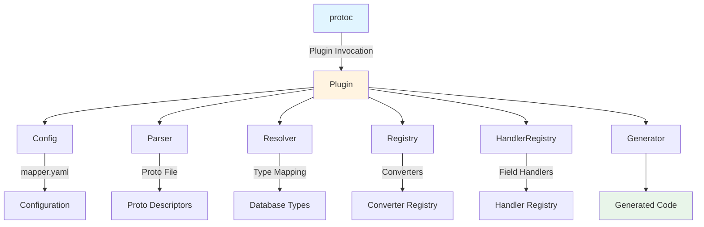
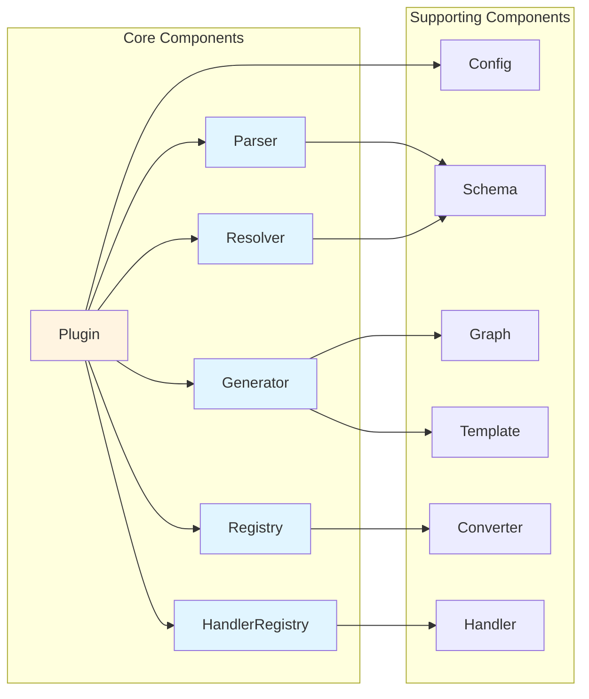
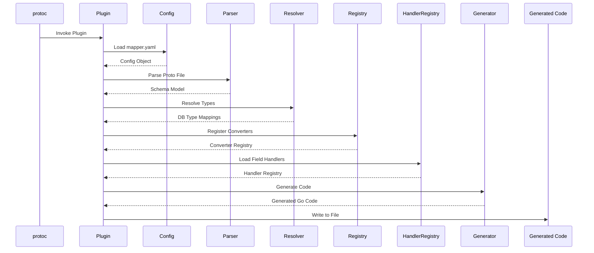
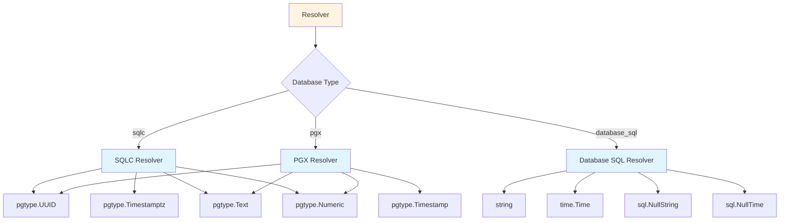
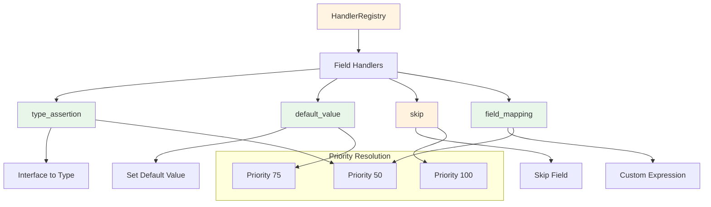
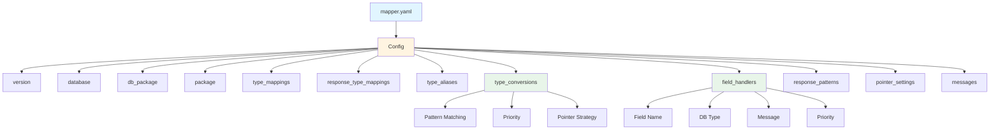
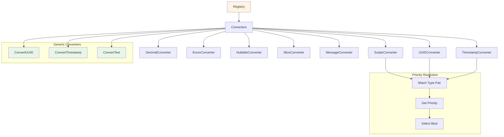
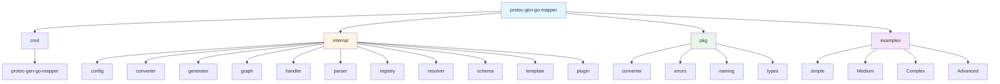
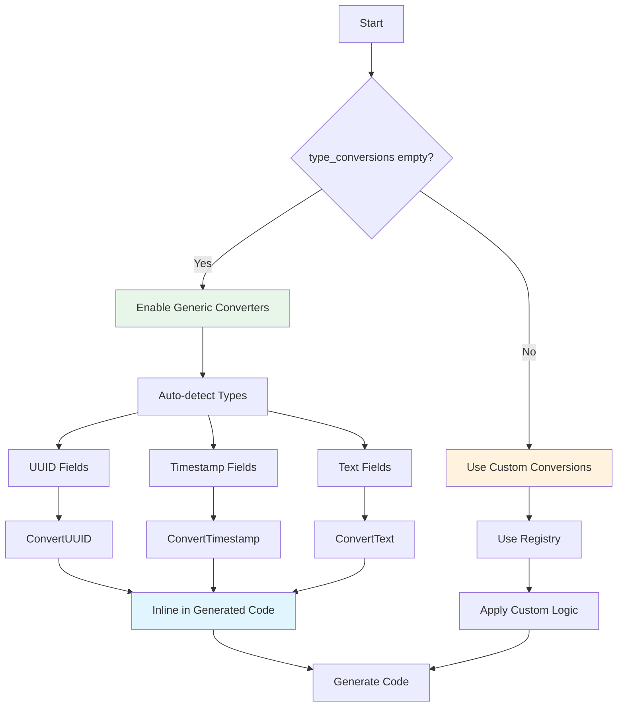
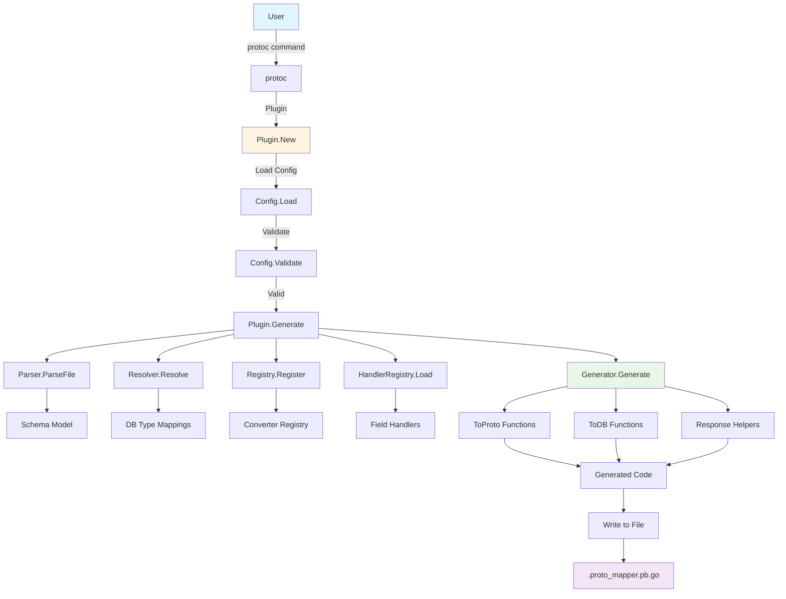

# Diagram Arsitektur protoc-gen-go-mapper

## Arsitektur

Diagram ini menunjukkan alur keseluruhan dari pemanggilan protoc hingga output kode yang dihasilkan. Plugin mengoordinasikan semua komponen, mengoordinasikan pemuatan konfigurasi, parsing proto, resolusi tipe, pendaftaran converter, pemuatan field handler, dan pembuatan kode.

**Komponen:**
- **protoc**: Kompilator Protocol Buffers yang memanggil plugin
- **Plugin**: Orkestrator utama yang mengoordinasikan semua komponen
- **Config**: Memuat dan memvalidasi konfigurasi mapper.yaml
- **Parser**: Mengekstrak file proto dan mengekstrak definisi message
- **Resolver**: Memetakan tipe protobuf ke tipe database spesifik
- **Registry**: Mengelola pendaftaran dan resolusi converter
- **HandlerRegistry**: Mengelola field handler untuk kasus khusus
- **Generator**: Menghasilkan kode pemetaan Go
- **Generated Code**: File output akhir dengan fungsi pemetaan

## Diagram Interaksi Komponen

Diagram ini mengilustrasikan hubungan antara komponen inti dan pendukung. Plugin bertindak sebagai koordinator pusat, menghubungkan ke semua komponen inti (Parser, Resolver, Registry, Generator, HandlerRegistry) dan komponen Config. Komponen pendukung (Schema, Graph, Template, Converter, Handler) menyediakan definisi tipe, struktur pemetaan, template kode, logika konversi, dan kemampuan penanganan field.

**Komponen Inti:**
- **Plugin**: Koordinator pusat
- **Parser**: Mengekstrak struktur message dari file proto
- **Resolver**: Memetakan tipe antara protobuf dan database
- **Registry**: Mengelola pendaftaran converter
- **Generator**: Menghasilkan kode Go akhir
- **HandlerRegistry**: Mengelola logika kustom tingkat field

**Komponen Pendukung:**
- **Config**: Manajemen konfigurasi
- **Schema**: Definisi sistem tipe
- **Graph**: Struktur graf pemetaan
- **Template**: Template pembuatan kode
- **Converter**: Implementasi konversi tipe
- **Handler**: Implementasi field handler

## Diagram Aliran Data

Diagram urutan ini menunjukkan alur eksekusi langkah demi langkah dari pemanggilan protoc hingga output file. Proses dimulai dengan protoc memanggil Plugin, yang kemudian memuat konfigurasi, mengurai file proto, menyelesaikan tipe, mendaftarkan converter, memuat field handler, membuat kode, dan akhirnya menulis kode yang dihasilkan ke file.

**Langkah Alur:**
1. **protoc** memanggil Plugin
2. **Plugin** memuat konfigurasi mapper.yaml
3. **Config** mengembalikan objek konfigurasi yang divalidasi
4. **Plugin** mengurai file proto untuk mengekstrak definisi message
5. **Parser** mengembalikan model skema dengan struktur message
6. **Plugin** menyelesaikan tipe protobuf ke tipe database
7. **Resolver** mengembalikan pemetaan tipe database
8. **Plugin** mendaftarkan converter bawaan dan kustom
9. **Registry** mengembalikan registry converter
10. **Plugin** memuat field handler dari konfigurasi
11. **HandlerRegistry** mengembalikan registry field handler
12. **Plugin** membuat kode pemetaan
13. **Generator** mengembalikan kode Go yang dihasilkan
14. **Plugin** menulis kode yang dihasilkan ke file

## Arsitektur Resolver Database

Diagram ini menunjukkan bagaimana Resolver memetakan tipe protobuf ke tipe database spesifik berdasarkan backend database yang dikonfigurasi. Resolver menggunakan pernyataan switch untuk memilih resolver yang sesuai (SQLC, PGX, atau database_sql), yang masing-masing memiliki strategi pemetaan tipe sendiri.

**Backend Database:**
- **SQLC**: Menggunakan tipe pgtype untuk PostgreSQL (UUID, Timestamptz, Text, Numeric)
- **PGX**: Menggunakan tipe pgtype dengan variasi sedikit (UUID, Timestamp, Text, Numeric)
- **database_sql**: Menggunakan tipe Go standar (string, time.Time, sql.NullString, sql.NullTime)

**Pemetaan Tipe:**
- **UUID**: pgtype.UUID (SQLC/PGX) atau string (database_sql)
- **Timestamp**: pgtype.Timestamptz (SQLC), pgtype.Timestamp (PGX), atau time.Time (database_sql)
- **Text**: pgtype.Text (SQLC/PGX) atau string (database_sql)
- **Numeric**: pgtype.Numeric (SQLC/PGX) atau string (database_sql)

## Arsitektur Sistem Handler

Diagram ini menunjukkan sistem field handler yang menyediakan kustomisasi tingkat field yang fleksibel. HandlerRegistry mengelola beberapa tipe handler, masing-masing dengan tujuan spesifik. Handler diselesaikan menggunakan pencocokan berbasis prioritas, di mana handler dengan prioritas lebih tinggi diutamakan.

**Tipe Handler:**
- **type_assertion**: Menangani asersi tipe untuk field interface{} (misalnya, mengonversi interface{} ke []string untuk field array SQLC)
- **default_value**: Menetapkan nilai default untuk field yang tidak ada di sumber (misalnya, slice kosong untuk anak pohon)
- **skip**: Melewati field selama pemetaan (misalnya, field soft delete dalam respons)
- **field_mapping**: Menyediakan ekspresi kustom untuk kedua arah ToProto dan ToDB

**Level Prioritas:**
- **Prioritas 100**: Prioritas tertinggi (misalnya, handler skip)
- **Prioritas 75**: Prioritas menengah-tinggi (misalnya, handler nilai default)
- **Prioritas 50**: Prioritas menengah (misalnya, handler asersi tipe)

## Sistem Konfigurasi

Diagram ini menunjukkan struktur file konfigurasi mapper.yaml. Objek Config memuat dan memvalidasi semua opsi konfigurasi, yang mengontrol bagaimana plugin menghasilkan fungsi pemetaan. Konversi tipe dan field handler mendukung fitur lanjutan seperti pencocokan pola, resolusi berbasis prioritas, dan strategi pointer.

**Opsi Konfigurasi:**
- **version**: Versi konfigurasi (harus "v1")
- **database**: Tipe database (sqlc, pgx, database_sql)
- **db_package**: Jalur paket Go untuk model database
- **package**: Nama paket Proto dan DB
- **type_mappings**: Pemetaan kustom message proto ke model DB
- **response_type_mappings**: Pemetaan message respons ke tipe Row SQLC
- **type_aliases**: Definisi konversi tipe yang dapat digunakan kembali
- **type_conversions**: Aturan konversi tipe kustom dengan pencocokan pola
- **field_handlers**: Logika kustom tingkat field
- **response_patterns**: Konfigurasi helper respons
- **pointer_settings**: Strategi penanganan pointer
- **messages**: Daftar message untuk membuat mapper

**Fitur Lanjutan:**
- **Pattern Matching**: Pencocokan nama field dan message berbasis regex
- **Priority**: Resolusi berbasis prioritas untuk beberapa kecocokan
- **Pointer Strategy**: strict, lenient, atau omit untuk field nullable

## Registry Converter

Diagram ini menunjukkan sistem registry converter yang mengelola logika konversi tipe. Registry mempertahankan koleksi converter untuk pasangan tipe yang berbeda (Scalar, UUID, Timestamp, Decimal, Enum, Nullable, Slice, Message). Ketika type_conversions kosong (mode zero-config), converter generik (ConvertUUID, ConvertTimestamp, ConvertText) secara otomatis digunakan. Registry menggunakan resolusi berbasis prioritas untuk memilih converter terbaik ketika beberapa converter cocok dengan pasangan tipe.

**Converter Bawaan:**
- **ScalarConverter**: Menangani tipe skalar dasar (int32, int64, string, bool, float64)
- **UUIDConverter**: Menangani konversi tipe UUID
- **TimestampConverter**: Menangani konversi tipe timestamp
- **DecimalConverter**: Menangani konversi tipe desimal/numerik
- **EnumConverter**: Menangani konversi tipe enum
- **NullableConverter**: Menangani konversi tipe nullable/opsional
- **SliceConverter**: Menangani konversi tipe array/slice
- **MessageConverter**: Menangani konversi tipe message bersarang

**Converter Generik (Mode Zero-Config):**
- **ConvertUUID**: Konversi otomatis UUID ↔ string
- **ConvertTimestamp**: Konversi otomatis Timestamp ↔ time.Time
- **ConvertText**: Konversi otomatis Text ↔ string

**Proses Resolusi:**
1. Cocokkan pasangan tipe dengan semua converter yang terdaftar
2. Dapatkan prioritas untuk setiap converter yang cocok
3. Pilih converter dengan prioritas tertinggi
4. Kembalikan error jika beberapa converter memiliki prioritas yang sama (pemetaan ambigu)

## Struktur Paket

Diagram ini menunjukkan organisasi paket keseluruhan dari proyek protoc-gen-go-mapper. Proyek dibagi menjadi empat direktori utama: cmd (antarmuka baris perintah), internal (implementasi inti), pkg (paket publik), dan examples (implementasi sampel).

**Struktur Direktori:**
- **cmd**: Berisi alat baris perintah protoc-gen-go-mapper utama
- **internal**: Paket implementasi inti (config, converter, generator, graph, handler, parser, registry, resolver, schema, template, plugin)
- **pkg**: Paket publik (converter, errors, naming, types)
- **examples**: Implementasi sampel (simple, medium, complex, advanced)

**Paket Internal:**
- **config**: Pemuatan dan validasi konfigurasi
- **converter**: Implementasi converter generik
- **generator**: Logika pembuatan kode
- **graph**: Struktur graf pemetaan
- **handler**: Implementasi field handler
- **parser**: Parsing file proto
- **registry**: Pendaftaran dan resolusi converter
- **resolver**: Resolusi tipe untuk database yang berbeda
- **schema**: Definisi sistem tipe
- **template**: Template pembuatan kode
- **plugin**: Orkestrasi plugin utama

**Paket Publik:**
- **converter**: Antarmuka converter publik
- **errors**: Definisi error
- **naming**: Utilitas konvensi penamaan
- **types**: Utilitas sistem tipe

## Alur Mode Zero-Config

Diagram ini menunjukkan alur mode zero-config, yang diaktifkan ketika type_conversions kosong dalam konfigurasi. Dalam mode ini, plugin secara otomatis menggunakan converter generik bawaan untuk tipe umum (UUID, Timestamp, Text) tanpa memerlukan konfigurasi eksplisit. Converter generik diinlining langsung ke dalam kode yang dihasilkan, membuatnya mandiri tanpa dependensi eksternal.

**Proses Zero-Config:**
1. Periksa apakah type_conversions kosong
2. Jika kosong, aktifkan converter generik
3. Deteksi otomatis tipe field (UUID, Timestamp, Text)
4. Terapkan converter generik yang sesuai
5. Inline fungsi converter dalam kode yang dihasilkan
6. Buat kode pemetaan akhir

**Converter Generik:**
- **ConvertUUID**: Menangani konversi UUID ↔ string untuk field nullable dan non-nullable
- **ConvertTimestamp**: Menangani konversi Timestamp ↔ time.Time
- **ConvertText**: Menangani konversi Text ↔ string untuk field nullable dan non-nullable

**Manfaat:**
- Tidak ada konfigurasi yang diperlukan untuk tipe umum
- Kode yang dihasilkan mandiri
- Deteksi tipe otomatis
- Kompleksitas konfigurasi berkurang

## Pipeline Lengkap

Diagram ini menunjukkan pipeline end-to-end lengkap dari pemanggilan pengguna hingga output kode yang dihasilkan. Proses dimulai dengan pengguna menjalankan perintah protoc, yang memanggil Plugin. Plugin kemudian memuat dan memvalidasi konfigurasi, mengurai file proto, menyelesaikan tipe, mendaftarkan converter, memuat field handler, membuat fungsi pemetaan (ToProto, ToDB, dan Response Helpers), dan akhirnya menulis kode yang dihasilkan ke file .proto_mapper.pb.go.

**Tahap Pipeline:**
1. **Pemanggilan Pengguna**: Pengguna menjalankan protoc dengan plugin mapper
2. **Inisialisasi Plugin**: Plugin.New membuat instance plugin
3. **Pemuatan Konfigurasi**: Config.Load membaca mapper.yaml
4. **Validasi Konfigurasi**: Config.Validate memeriksa konfigurasi
5. **Generasi**: Plugin.Generate mengoordinasikan proses pembuatan
6. **Parsing Proto**: Parser.ParseFile mengekstrak definisi message
7. **Resolusi Tipe**: Resolver.Resolve memetakan tipe ke tipe database
8. **Pendaftaran Converter**: Registry.Register mendaftarkan converter
9. **Pemuatan Handler**: HandlerRegistry.Load memuat field handler
10. **Pembuatan Kode**: Generator.Generate menghasilkan fungsi pemetaan
11. **Output**: Kode yang dihasilkan ditulis ke file .proto_mapper.pb.go

**Fungsi yang Dihasilkan:**
- **Fungsi ToProto**: Mengonversi model database ke message protobuf
- **Fungsi ToDB**: Mengonversi message protobuf ke model database
- **Helper Respons**: Fungsi khusus untuk respons daftar

